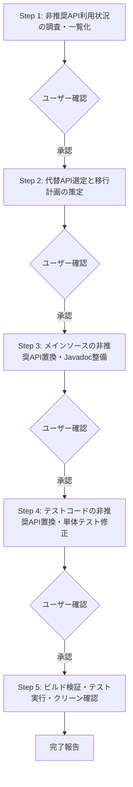

# 非推奨API解消（clean-deprecated）指示書

Mavenプロジェクト内のJavaソースコードおよびテストコードを対象に、非推奨（Deprecated）APIの利用状況を調査し、以下の実行ワークフローに従って段階的に最新の推奨APIへの移行および動作検証を実施してください。

---

## 1. 前提条件・スコープ定義

### 1.1 レビュー・変更対象範囲
- **対象ソース**: `src/main/java` 配下の `src/main/java/${groupId}`（例: `groupId=tool` の場合は `src/main/java/tool` 配下）および対応するテストコード `src/test/java/${groupId}` のみを対象とします。
- **変更禁止範囲**:
  - `src/main/java/${groupId}` および `src/test/java/${groupId}` 以外のディレクトリ（例: `src/main/java/org/...` や外部導入ライブラリなど）は一切変更しないでください。
  - プロジェクトルートより上位のディレクトリ、およびプロジェクト外のファイルには一切影響を与えないでください。

### 1.2 準拠コーディング規約
- リファクタリングおよびコード生成にあたっては、以下の規約を厳格に遵守してください。
  - `https://hide104y.github.io/markdown/JavaCodingStandards.md`

---

## 2. 実行ワークフロー（段階的タスク）

以下のステップを上から順番に実行してください。
**※各ステップの完了時にユーザーへ確認を求め、承認を得てから次のステップへ進んでください。**



---

### Step 1: 非推奨API利用状況の調査・一覧化
1. **コンパイラ警告による非推奨APIの検出**:
   - メインソースおよびテストコードの双方を対象に、非推奨API警告を有効にしてMavenコンパイルを実行してください。
     ```bash
     mvn clean test-compile "-Dmaven.compiler.showDeprecation=true"
     ```
2. **調査結果の整理**:
   - 警告ログから以下の項目を抽出・一覧化し、ユーザーに提示してください：
     - 対象ファイルパスおよび行番号
     - 使用されている非推奨クラス / メソッド / フィールド
     - 警告メッセージの内容

---

### Step 2: 代替API選定と移行計画の策定
1. **推奨される代替APIの特定**:
   - 非推奨APIの公式Javadoc（`@deprecated` タグの説明文、`@see`、代替メソッドの推奨）や公式ドキュメントを確認し、最新の推奨API・移行パターンを特定してください。
   - プロジェクトのJavaバージョン（`pom.xml` の `<java.version>`）で利用可能な最適な言語仕様・標準APIを活用してください。
2. **移行方針の整理**:
   - 単に警告を抑制するのではなく、安全な代替コードへの書き換え方針を策定してください。
   - 外部ライブラリ由来のAPIで代替がないなど、やむを得ず置換できない場合の取り扱いを検討してください。

---

### Step 3: メインソースの非推奨API置換・Javadoc整備
1. **メインコード（`src/main/java/${groupId}`）の置換**:
   - Step 2 で策定した方針に基づき、非推奨APIを推奨APIへ置換してください。
   - 不要になった `@Deprecated` メソッドやフィールドの下位互換性維持は原則不要です（既存コード整理・削除）。
2. **Javadocコメントの作成・更新**:
   - 変更箇所のJavadocコメントを最新のコード実装に合わせて更新してください。
   - 書式: `/**` で開始し、各行頭に ` * ` を置き、`*/` で閉じてください。
   - 1行目にメソッド・クラスの処理概要を簡潔に記述してください。
   - メソッドには `@param`、`@return`、`@throws` などの標準タグを網羅し、設計意図（Why）を明確にしてください。
   - `@author` および `@version` タグは記載しないでください（既存のものは除去）。

---

### Step 4: テストコードの非推奨API置換・単体テスト修正
1. **テストコード（`src/test/java/${groupId}`）の置換**:
   - テストコード内で使用されている非推奨API・アサーションを最新の推奨記法（JUnit 5 / AssertJ等）へ置換してください。
   - メインコード側の変更に伴い影響を受けたテストケースを追従・修正してください。
2. **テスト環境の隔離と作業ディレクトリ**:
   - ファイルの作成・削除を伴うテストでは、JUnit 5 の `@TempDir` アノテーションを使用するか、以下の作業ディレクトリ配下のみを使用してください：
     ```java
     Path tempDir = Paths.get(System.getProperty("java.io.tmpdir"), "UnitTest", projectName, className);
     ```

---

### Step 5: ビルド検証・テスト実行・クリーン確認
1. **全単体テストの実行・動作検証**:
   - すべての単体テストを実行し、テストが全件パス（Green）することを確認してください。
     ```bash
     mvn clean test
     ```
2. **非推奨API警告ゼロ（Clean）の確認**:
   - 再度 `-Dmaven.compiler.showDeprecation=true` を付与してコンパイルを実行し、対象スコープ内（`${groupId}` 配下）の非推奨API警告が解消されていることを確認してください。
     ```bash
     mvn clean test-compile "-Dmaven.compiler.showDeprecation=true"
     ```

---

## 3. 非推奨API解消ガイドライン（技術仕様）

### 3.1 推奨APIへの安全な移行原則
- **標準API・モダン機能の優先**:
  - レガシーなユーティリティ（例: `java.util.Date`, `Vector`, `Hashtable`, 古いI/Oストリーム処理等）は、Java標準のモダンAPI（`java.time.*`, `java.util.List`, `java.nio.file.*` 等）へ積極的に置き換えてください。
- **不変性と安全性の確保**:
  - コレクション生成時は `List.of()`, `Map.of()` などの不変コレクションファクトリや、Stream APIを活用してください。

### 3.2 `@SuppressWarnings("deprecation")` の利用基準
- **原則禁止**:
  - 非推奨APIの利用を単に隠蔽するための `@SuppressWarnings("deprecation")` の安易な付与は禁止します。
- **例外的な許容条件**:
  - 外部ライブラリの制約等により代替APIが存在せず、どうしても非推奨APIを呼び出さざるを得ない場合に限り付与を認めます。
  - その際は、**「なぜ代替できないのか」「将来の対応方針」** をコメントとして明記し、スコープを最小限（メソッド単位または変数単位）に限定してください。

---

## 4. 制約事項・運用ルール (Guardrails)

1. **ステップごとの確認プロトコル**:
   - 各ステップが完了するごとに、**「実施した作業内容の要約」** および **「変更・生成したファイル一覧」** をユーザーに報告し、確認を求めてください。
   - ユーザーから確認・承認の指示を得てから、初めて次のステップに着手してください。
2. **安全性の確保**:
   - プロジェクト外へのファイルの書き出し、カレントディレクトリ上位のファイル操作は絶対に行わないでください。
   - 対象外パッケージ（`src/main/java/${groupId}` 以外）のファイルを誤って修正しないよう、作業前に対象パスを再確認してください。
