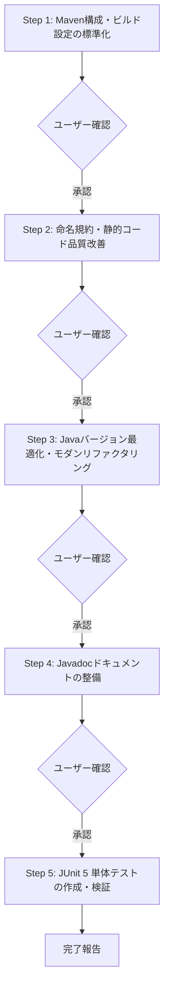

# Javaソースコードレビュー＆リファクタリング指示書

指定されたパスのJavaソースコードを精査し、以下の実行ワークフローに従って段階的にレビューおよび修正を実施してください。

---

## 1. 前提条件・スコープ定義

### 1.1 レビュー・変更対象範囲
- **対象ソース**: `src/main/java` 配下の `src/main/java/${groupId}`（例: `groupId=tool` の場合は `src/main/java/tool` 配下）および対応するテストコード `src/test/java/${groupId}` のみを対象とします。
- **変更禁止範囲**:
  - `src/main/java/${groupId}` 以外のディレクトリ（例: `src/main/java/org/...` や外部導入ライブラリなど）は一切変更しないでください。
  - プロジェクトルートより上位のディレクトリ、およびプロジェクト外のファイルには一切影響を与えないでください。

### 1.2 準拠コーディング規約
- リファクタリングおよびコード生成にあたっては、以下の規約を厳格に遵守してください。
  - `https://hide104y.github.io/markdown/JavaCodingStandards.md`

---

## 2. 実行ワークフロー（段階的タスク）

以下のステップを上から順番に実行してください。
**※各ステップの完了時にユーザーへ確認を求め、承認を得てから次のステップへ進んでください。**



---

### Step 1: プロジェクト構成・ビルド設定の標準化 (Maven化)
1. **ディレクトリ構造の移行**:
   - ディレクトリ構造がMaven標準（`src/main/java`, `src/main/resources`, `src/test/java`, `src/test/resources`）に準拠していない場合は、Maven標準構成へ移行してください。
2. **ビルド設定ファイルの構築**:
   - `pom.xml` が存在せず `build.xml`（Ant形式）が存在する場合は、`build.xml` の内容（クラスパス、ソースパス、コンパイル設定等）を参照してプロジェクト全体をMaven形式（`pom.xml`）に変更してください。
   - プロジェクトを新規作成する場合、または `pom.xml` を新規生成する場合は `groupId` に `tool` を設定してください。

---

### Step 2: 命名規則と静的コード品質の改善
1. **命名規則の適用 (`JavaCodingStandards.md` 準拠)**:
   - クラス名（`UpperCamelCase`）、メソッド名・変数名（`lowerCamelCase`）、定数（`UPPER_SNAKE_CASE`）を適用してください。
   - ハンガリアン記法（型プレフィックス等）を排除し、モダンなJava記法へ変更してください。
   - 識別子が20文字を超える場合は、意味を損なわない範囲で一般的な略称（例: `Config`, `Init`, `Param`, `Repo`, `Ctx` 等）を活用し、過度に長すぎない名称に整えてください。
2. **非推奨APIの置換とメソッド整理**:
   - 非推奨（Deprecated）メソッド・APIを発見した場合は、推奨される最新APIへ変更してください。
   - 下位互換性確保のための `@Deprecated` メソッドの残存・新規追加は不要です（不要な場合は削除または置換）。
   - 全く同じ処理内容のメソッドが異なる名称で複数存在する場合は、1つに統合し、呼び出し元の参照も漏れなく更新してください。

---

### Step 3: Javaバージョン最適化とモダンリファクタリング
プロのJavaエンジニアの視点でコードの設計・保守性・安全性をレビューし、改善してください。

1. **指定Javaバージョンへの最適化**:
   - `pom.xml` の `<java.version>`（または `<maven.compiler.release>`）に指定されたJavaバージョンを確認し、そのバージョンで利用可能な言語仕様・APIへ最適化してください。
   - 例: Java 17/21 の場合、Record、Sealed Classes、instanceof や switch のパターンマッチング、テキストブロック（`"""`）、型推論 `var`、不変コレクションファクトリ（`List.of()` 等）、try-with-resources の徹底。
2. **設計・品質の改善**:
   - インターフェース型での宣言（`List`, `Map` 等の活用）。
   - 単一責任の原則に基づくメソッド分割。
   - 不変性（Immutability）の確保と適切な可視性（アクセスマスク）の設定。
   - 具体的な例外クラスの利用（汎用 `Exception` の直接スローや握りつぶしの禁止）。

---

### Step 4: Javadocドキュメントの整備
クラスおよびメソッドに、コーディング規約に準拠したJavadocコメントを記述・更新してください。

1. **記述ルール**:
   - 既存のコメントは古い情報を含む可能性があるため、コード内容に合わせて上書き更新してください。
   - 書式: `/**` で開始し、各行頭に ` * ` を置き、`*/` で閉じてください。
   - 1行目にメソッド・クラスの処理概要を簡潔かつ明確に記述してください。
   - メソッドには `@param`、`@return`、`@throws` などの標準タグを網羅し、必要に応じて処理概要・前提条件・使用例を記述してください（サンプルコードには `{@snippet}` を推奨）。
   - なぜその処理が必要なのか（Why/設計意図）が分かるコメントを心がけてください。
2. **禁止タグ**:
   - バージョン管理システム（Git）で管理するため、`@author` および `@version` は記載しないでください（既存のものは除去）。

---

### Step 5: JUnit 5 単体テストの作成と検証
テストコードを作成し、すべてのテストが正常に成功することを確認してください。

1. **テストフレームワーク**:
   - テストフレームワークには **JUnit 5 (Jupiter)** を使用してください（必要に応じて AssertJ / Mockito を活用）。
2. **隔離環境と作業ディレクトリ**:
   - テスト実行によって環境を汚染しないよう、副作用を最小限に抑えてください。
   - ファイルの作成・削除を伴うテストでは、JUnit 5 の `@TempDir` アノテーションを使用するか、以下の作業ディレクトリ配下のみを使用してください：
     ```java
     Path tempDir = Paths.get(System.getProperty("java.io.tmpdir"), "UnitTest", projectName, className);
     ```
3. **テスト検証**:
   - 単体テストを実行（Mavenコマンド等）し、テストがすべてパス（Green）することを確認してください。

---

## 3. 制約事項・運用ルール (Guardrails)

1. **ステップごとの確認プロトコル**:
   - 各ステップが完了するごとに、**「実施した作業内容の要約」** および **「変更・生成したファイル一覧」** をユーザーに報告し、確認を求めてください。
   - ユーザーから確認・承認の指示を得てから、初めて次のステップに着手してください。
2. **安全性の確保**:
   - プロジェクト外へのファイルの書き出し、カレントディレクトリ上位のファイル操作は絶対に行わないでください。
   - 対象外パッケージのファイルを誤って修正しないよう、作業前に対象パスを再確認してください。
