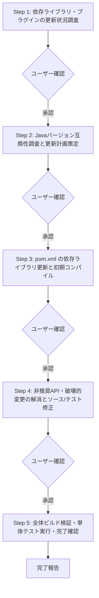

# 依存ライブラリ更新（update-dependencies）指示書

Mavenプロジェクト内の依存ライブラリおよびプラグインの更新状況を調査し、以下の実行ワークフローに従って段階的にライブラリのアップデート、非推奨APIの解消、および動作検証を実施してください。

---

## 1. 前提条件・スコープ定義

### 1.1 レビュー・変更対象範囲
- **設定ファイル**: `pom.xml`
- **対象ソース**: `src/main/java` 配下の `src/main/java/${groupId}`（例: `groupId=tool` の場合は `src/main/java/tool` 配下）および対応するテストコード `src/test/java/${groupId}` のみを対象とします。
- **変更禁止範囲**:
  - `src/main/java/${groupId}` および `src/test/java/${groupId}` 以外のディレクトリ（例: `src/main/java/org/...` や外部導入ライブラリなど）は一切変更しないでください。
  - プロジェクトルートより上位のディレクトリ、およびプロジェクト外のファイルには一切影響を与えないでください。

### 1.2 準拠コーディング規約
- リファクタリングおよびコード生成にあたっては、以下の規約を厳格に遵守してください。
  - `https://hide104y.github.io/markdown/JavaCodingStandards.md`

---

## 2. 実行ワークフロー（段階的タスク）

以下のステップを上から順番に実行してください。
**※各ステップの完了時にユーザーへ確認を求め、承認を得てから次のステップへ進んでください。**



---

### Step 1: 依存ライブラリ・プラグインの更新状況調査
1. **依存関係の更新確認**:
   - `versions-maven-plugin` を実行して、利用可能な新しい依存ライブラリを調査してください。
     ```bash
     mvn versions:display-dependency-updates
     ```
2. **プラグイン・プロパティの更新確認（必要に応じて）**:
   - プラグインやプロパティの更新状況も併せて確認してください。
     ```bash
     mvn versions:display-plugin-updates
     mvn versions:display-property-updates
     ```
3. **調査結果の整理**:
   - 現在のバージョンと利用可能な最新バージョンを一覧表として整理し、ユーザーに提示してください。

---

### Step 2: Javaバージョン互換性調査と更新計画の策定
1. **プロジェクトのJavaバージョンの特定**:
   - `pom.xml` 内の `<java.version>`, `<maven.compiler.source>`, `<maven.compiler.target>`, `<maven.compiler.release>` 等を確認し、プロジェクトのJavaバージョン（例: Java 17）を特定してください。
2. **ライブラリ新バージョンの互換性調査**:
   - 更新候補ライブラリの新バージョンが、プロジェクトのJavaバージョンに対応しているか（最小要件および互換性）を公式ドキュメント、リリースノート、リポジトリ等から調査してください。
   - メジャーバージョンアップ等で大幅な破壊的変更（APIの廃止・仕様変更）が含まれるか確認してください。
3. **更新計画の策定**:
   - 互換性のあるライブラリを更新対象として選定し、更新計画（更新理由・バージョン差分・想定される影響）を策定してユーザーに提示してください。

---

### Step 3: `pom.xml` の依存ライブラリ更新と初期コンパイル
1. **`pom.xml` の更新**:
   - Step 2 で承認された計画に基づき、`pom.xml` の `<dependencies>` または `<properties>` 内のバージョン定義を更新してください。
2. **初期コンパイル確認**:
   - 依存ライブラリを更新した状態でコンパイルが通るか確認してください。
     ```bash
     mvn clean test-compile
     ```
   - コンパイルエラー（破壊的変更やメソッドシグネチャ変更等）が発生した場合は、エラー内容を整理してください。

---

### Step 4: 非推奨API・破壊的変更の解消とソース/テスト修正
1. **非推奨（Deprecated）APIの調査**:
   - コンパイラの非推奨警告を有効にしてコンパイルを実行し、更新に伴い新たに非推奨となったAPIや既存の非推奨APIの利用状況を調査してください。
     ```bash
     mvn clean test-compile "-Dmaven.compiler.showDeprecation=true"
     ```
2. **メインソース（`src/main/java/${groupId}`）の修正**:
   - ライブラリ更新に伴う破壊的変更および非推奨APIを、最新の推奨APIへ置換・リファクタリングしてください。
   - コーディング規約（`D:\Github\CodingStandards\JavaCodingStandards.md`）に準拠してください。
   - Javadocコメントを更新してください（書式: `/** ... */`、1行目に処理概要、`@param`/`@return`/`@throws` 網羅、Whyの記載、`@author`/`@version` 記載禁止）。
3. **テストコード（`src/test/java/${groupId}`）の修正**:
   - テストコード内の非推奨APIや破壊的変更箇所を修正し、メインソースの変更に追従させてください。
   - 単体テスト内でのファイル作成・削除を伴う作業は、JUnit 5 の `@TempDir` を使用するか、以下の一時作業ディレクトリ配下のみを使用してください：
     ```java
     Path tempDir = Paths.get(System.getProperty("java.io.tmpdir"), "UnitTest", projectName, className);
     ```

---

### Step 5: 全体ビルド検証・単体テスト実行・完了確認
1. **全単体テストの実行・動作検証**:
   - すべての単体テストを実行し、テストが全件パス（Green）することを確認してください。
     ```bash
     mvn clean test
     ```
2. **非推奨API警告およびコンパイルクリーン確認**:
   - 非推奨API警告が解消されていることを確認してください。
     ```bash
     mvn clean test-compile "-Dmaven.compiler.showDeprecation=true"
     ```
3. **最終報告**:
   - アップデートしたライブラリ一覧、修正したソースコード・テストコード一覧、テスト実行結果をまとめてユーザーに報告してください。

---

## 3. 技術仕様・品質ガイドライン

### 3.1 依存ライブラリ更新方針
- **互換性最優先**: プロジェクトの対象Javaバージョンで公式にサポートされているバージョンのみを採用してください。
- **段階的検証**: 依存関係を更新する際は、一度にすべてを変更して原因特定が困難になることを防ぐため、必要に応じて段階的に更新・コンパイル確認を行ってください。

### 3.2 Javadocドキュメント規則
- **書式**: `/**` で開始し、各行頭に ` * ` を置き、`*/` で閉じてください。
- **1行目**: メソッドやクラスの処理概要を簡潔に記述してください。
- **タグ**: `@param`, `@return`, `@throws` を適切に記述してください。
- **禁止タグ**: `@author` および `@version` は記載しないでください（既存のものは除去）。

### 3.3 単体テスト環境・一時ディレクトリの分離ルール
- テスト実行によってプロジェクト外の環境やローカル環境を汚染しないよう、副作用を最小限に抑えてください。
- 一時ディレクトリが必要な場合は、JUnit 5 の `@TempDir` を第一選択とし、手動作成時は `Paths.get(System.getProperty("java.io.tmpdir"), "UnitTest", projectName, className)` 配下を使用してください。

---

## 4. 制約事項・運用ルール (Guardrails)

1. **ステップごとの確認プロトコル**:
   - 各ステップが完了するごとに、**「実施した作業内容の要約」** および **「変更・生成したファイル一覧」** をユーザーに報告し、確認を求めてください。
   - ユーザーから確認・承認の指示を得てから、初めて次のステップに着手してください。
2. **安全性の確保**:
   - プロジェクト外へのファイルの書き出し、カレントディレクトリ上位のファイル操作は絶対に行わないでください。
   - 対象外パッケージ（`src/main/java/${groupId}` 以外）のファイルを誤って修正しないよう、作業前に対象パスを再確認してください。
